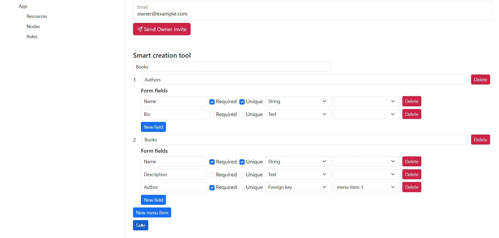

## What It's about

It's about a Low Code Web Development Platform that enable you to build rapidly web applications in which an application owner and authorized invited users can create and share data.

### Design your application

Accessing as administrator you can define which data the application owner can create, and you should define also which operations invited users can do.

### What the applications you create can do at first

Accessing as owner you can create, read, update and delete data. You should invite also users and share data with them enabling them to create, read, update and delete data too.

### Extending applications 

Applications created can be good starting point to evolve them with other domain specific code. 

## The Smart creation tool

Platform comes with a tool for smart design

## Login

You can log in with these credentials:

Admin (Backend access) - Email: admin@example.com - Password: 123

Owner (Frontend access) - Email: owner@example.com - Password: 123

## How you can support

